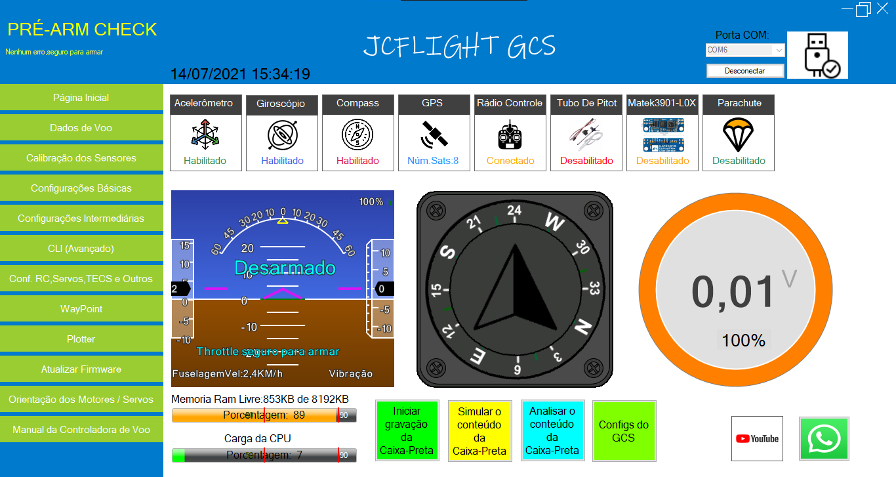
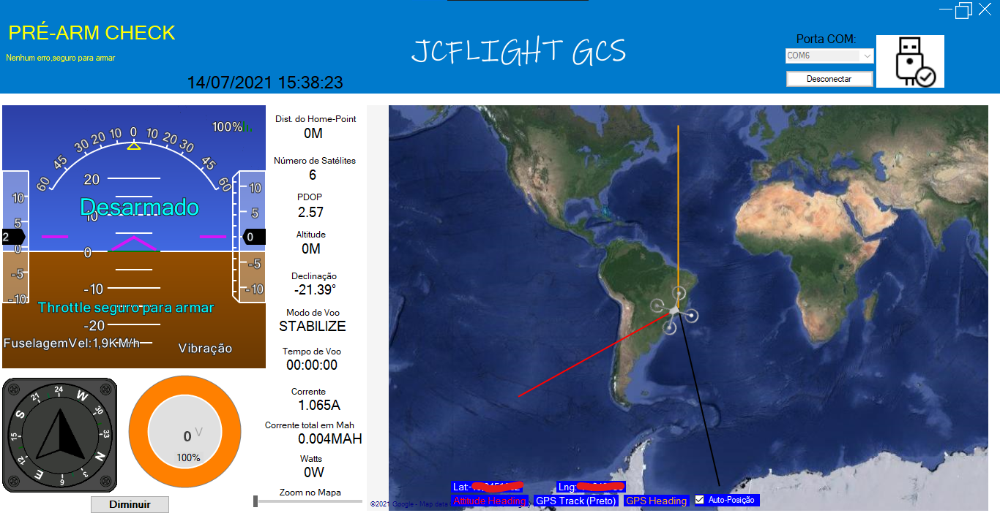
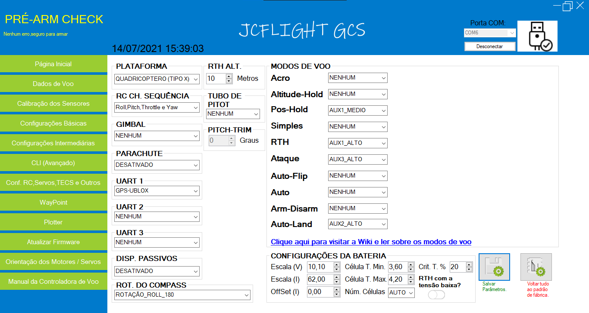
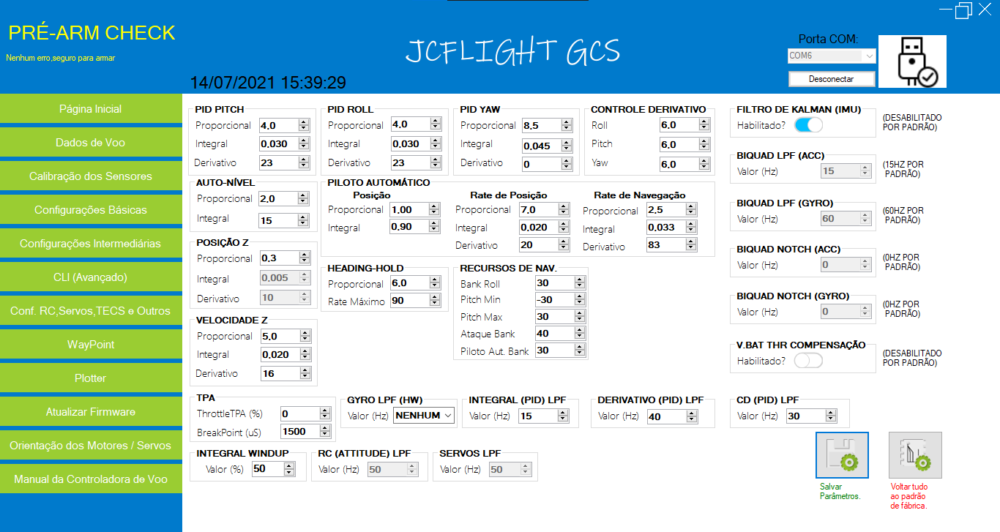
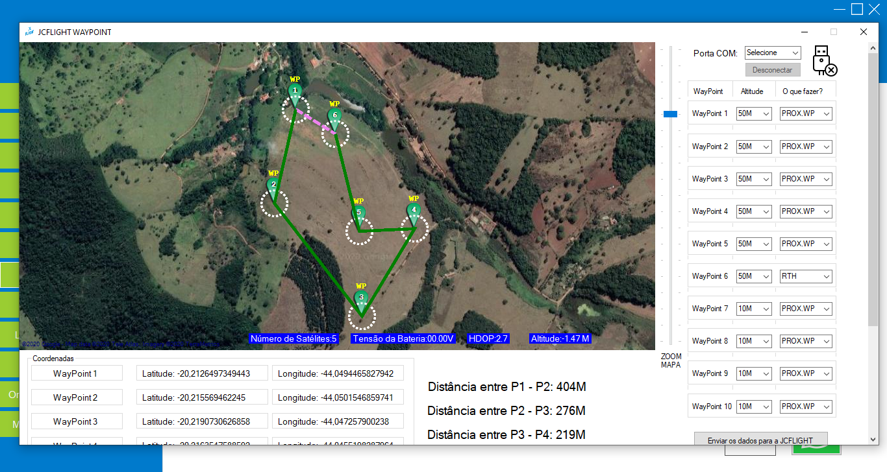
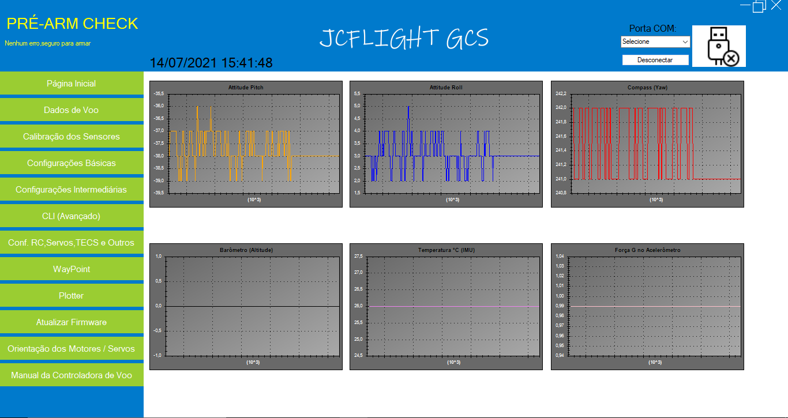

## Contribuidor

[Julio Cesar Matias](https://github.com/JulioCesarMatias)                                                          

## Como abrir

- Baixe o GCS da JCFLIGHT.
- Extraia o arquivo ZIP.
- Abra a pasta "JCFLIGHTGCS".
- Procure e abra a pasta "BIN",abra a pasta "DEBUG" e,abra o aplicativo "JCFLIGHTGCS".

## Como construir com o Visual Studio

- Baixe e instale Visual Studio Community clicando [aqui](https://visualstudio.microsoft.com/pt-br/downloads/).
- Baixe e abra o projeto do GCS da JCFLIGHT.
- Clique em "Iniciar" para depurar o GCS. 

## Como contribuir

- Caso você encontre algum bug,abra um Issue clicando [aqui](https://github.com/JCFLIGHT/JCLFIGHTGCS.git).
- Caso você deseja enviar alguma melhoria feita para o algoritimo,faça um Pull-Request.

## Fotos

